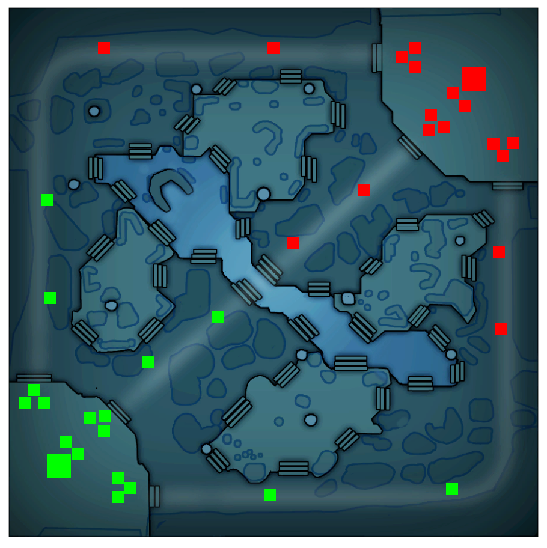

# Project Title

CSS styles to display the Dota 2 minimap on a webpage

## Usage

Create a div with a class of `d2map` and add buildings as desired using the appropriate positioning and display classes:

``` html
<div class="d2map">
            <div class="rad-top-t1 rad tower"></div>
            <div class="rad-top-t2 rad tower"></div>
            <div class="rad-top-t3 rad tower"></div>
            <div class="rad-middle-t1 rad tower"></div>
            <div class="rad-middle-t2 rad tower"></div>
            <div class="rad-middle-t3 rad tower"></div>
            <div class="rad-bottom-t1 rad tower"></div>
            <div class="rad-bottom-t2 rad tower"></div>
            <div class="rad-bottom-t3 rad tower"></div>
            <div class="dire-top-t1 dire tower"></div>
            <div class="dire-top-t2 dire tower"></div>
            <div class="dire-top-t3 dire tower"></div>
            <div class="dire-middle-t1 dire tower"></div>
            <div class="dire-middle-t2 dire tower"></div>
            <div class="dire-middle-t3 dire tower"></div>
            <div class="dire-bottom-t1 dire tower"></div>
            <div class="dire-bottom-t2 dire tower"></div>
            <div class="dire-bottom-t3 dire tower"></div>

            <div class="rad-t4-left rad tower"></div>
            <div class="rad-t4-right rad tower"></div>
            <div class="dire-t4-left dire tower"></div>
            <div class="dire-t4-right dire tower"></div>

            <div class="rad-top-melee rad barrack"></div>
            <div class="rad-top-ranged rad barrack"></div>
            <div class="rad-middle-melee rad barrack"></div>
            <div class="rad-middle-ranged rad barrack"></div>
            <div class="rad-bottom-melee rad barrack"></div>
            <div class="rad-bottom-ranged rad barrack"></div>
            <div class="dire-top-melee dire barrack"></div>
            <div class="dire-top-ranged dire barrack"></div>
            <div class="dire-middle-melee dire barrack"></div>
            <div class="dire-middle-ranged dire barrack"></div>
            <div class="dire-bottom-melee dire barrack"></div>
            <div class="dire-bottom-ranged dire barrack"></div>

            <div class="rad-ancient rad ancient"></div>
            <div class="dire-ancient dire ancient"></div>
    </div>
```

### Output: 



## Installation
### a) npm

Install via npm:

```
npm install dota2-minimap-css
```

And embed the stylesheet:
``` html
<link rel="stylesheet" type="text/css" href="./node_modules/dota2-minimap-css/assets/stylesheets/dota2minimap.css">
```

### b) copy files

Just copy the assets folder and link to the stylesheet in your HTML like above.